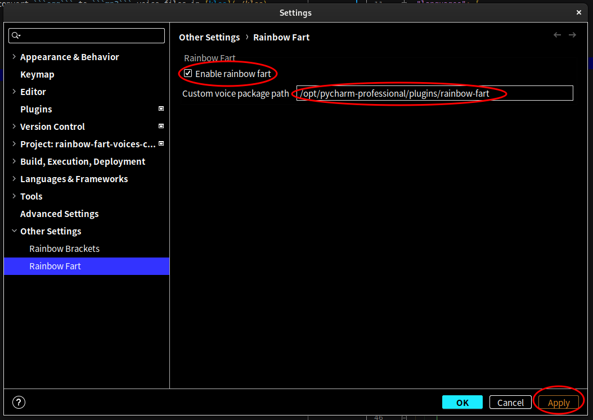

# rainbow-fart-voices-config

A configurations repo. for the Pycharm plugin, a.k.a., Rainbow-fart. It reveals a config to substitute in-built audios
with other files, e.g., Klee in Genshin Impact.

1. Download Pycharm and the plugins ```Rainbow Fart```
2. Download voice
    * I strongly recommend scratch Klee's voice
      from [Here](https://genshin-impact.fandom.com/wiki/Klee/Voice-Overs/Chinese).
    * Extract file links with the Chrome/Firefox add-ons, a.k.a., **Link Group**.
    * run ```download_voices.py``` to download and convert ```ogg``` to ```mp3``` voice files in [klee](./klee)
3. Design ```minifest.json```
4. Set ```Rainbow Fart``` config as follows:
   
